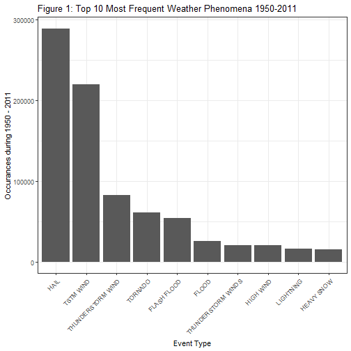
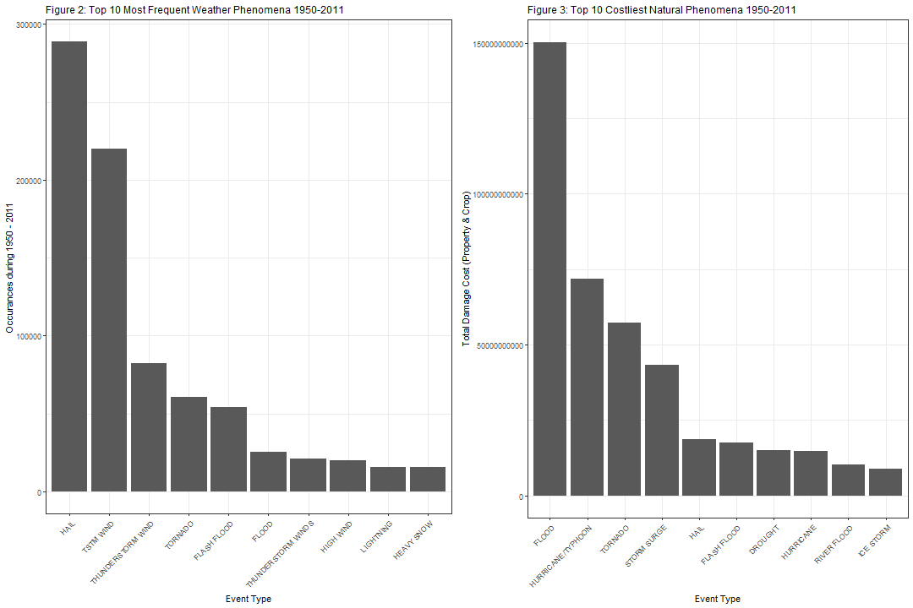

# US Storm Analysis: Natural Phenomenas and Their Affects On Health and Economics  

## Synopsis  

The analysis that was undertaken in this project was determining which natural weather phenomena created the most detrimental to the United States from 1950 to 2011. The first aspect of natural weather phenomena that was asses was casualties; this included both deaths and injuries from these phenomena. Economic damage cost was also assessed and categorized by both crop and property damage. The two were assessed separately at first and then combined to look at total cost. What was found was that flooding can affect human life in the United States at a far greater economic cost than the other phenomena; that includes rebuilding farms and businesses. While that was true, what later became apparent is that tornadoes were the most detrimental to the United States across the board. They had the third highest economic impact (Figure 3) and the number one highest casualties in the entire data set while being the fourth most common phenomena; flooding was only sixth.  

## Data Processing  

The following code will download the data and create a data frame object. The last line will stop R from loading in numerals in scientific notation.  


```r
fileURL <- 'https://d396qusza40orc.cloudfront.net/repdata%2Fdata%2FStormData.csv.bz2'
download.file(fileURL, destfile = paste0(getwd(), '/storm.zip'), method = "curl")

df <- read.csv(bzfile('storm.zip'), stringsAsFactors = F)
options(scipen = 999)
```

We will need the packages dplyr, ggplot2, and gridExtra for this analysis so the following will import those into the environment.    


```r
library(dplyr)
library(ggplot2)
library(gridExtra)
```

The data set's variables for Property and Crop damage is coded awkwardly for analysis. The following will multiply the numbers in Property and Crop damage respectively to get the full number of the cost of damage. It will also assign zero to the either non-reported or null costs (NA's) for easier computation. Lastly the code creates a variable of total damage costs by adding the Property and Crop damage costs together.    


```r
df$PROPDMGTOT <- case_when(
        df$PROPDMGEXP == 'K' ~ as.numeric(df$PROPDMG) * 1000,
        df$PROPDMGEXP == 'M' ~ as.numeric(df$PROPDMG) * 1000000,
        df$PROPDMGEXP == 'B' ~ as.numeric(df$PROPDMG) * 1000000000
)


df$CROPDMGTOT <- case_when(
        df$CROPDMGEXP == 'K' ~ as.numeric(df$CROPDMG) * 1000,
        df$CROPDMGEXP == 'M' ~ as.numeric(df$CROPDMG) * 1000000,
        df$CROPDMGEXP == 'B' ~ as.numeric(df$CROPDMG) * 1000000000
)

df$PROPDMGTOT[is.na(df$PROPDMGTOT)] <- 0
df$CROPDMGTOT[is.na(df$CROPDMGTOT)] <- 0

df$dmg_cost_total <- df$PROPDMGTOT + df$CROPDMGTOT
```

The data set is massive and for our analysis we don't need all of it. The questions, as mentioned before, center around economics, population health, and how natural storms/weather events effect them. Therefore, we can subset the main data set into a smaller one with those specific variables. The following code will create a new data frame with sums of deaths, injuries, property damage, crop damage, and total damage based on the event type. The sums of these variables was chosen to truncate the data and make it easier to work with.   


```r
df2 <- as.data.frame(levels(as.factor(df$EVTYPE)))
names(df2)[names(df2) == 'levels(as.factor(df$EVTYPE))'] <- 'EVTYPE'


df2$deaths <- tapply(df$FATALITIES, df$EVTYPE, sum)
df2$injuries <- tapply(df$INJURIES, df$EVTYPE, sum)
df2$PROPDMG <- tapply(df$PROPDMGTOT, df$EVTYPE, sum)
df2$CROPDMG <- tapply(df$CROPDMGTOT, df$EVTYPE, sum)
df2$TOTDMG <- tapply(df$dmg_cost_total, df$EVTYPE, sum)
```

## Results

The frequency of events was the first thing to look at to see which of these events were most common. this gives weight to whether or not a government should be planning more or less depending on the upcoming analysis. What is shown by Figure 1 is that Hail and wind seem to be the most frequent, but even with a cursory knowledge of natural weather phenomena, it can be ascertained that they would be hard to plan against. The 4th, 5th, and 6th most frequent phenomena are a lot more detrimental to a civilization and can be planned against.  

```r
occurance <- count(df, vars = EVTYPE)

top_occ <- occurance %>% 
        select(vars, n) %>%
        group_by(vars) %>%
        summarise(total_occ = n) %>%
        arrange(desc(total_occ)) %>%
        top_n(10, total_occ)

ggplot(top_occ, aes(reorder(vars, -total_occ), total_occ)) + geom_bar(stat = 'identity') +
        theme_bw() + labs(x = 'Event Type', y = 'Occurances during 1950 - 2011') +
        labs(title = 'Figure 1: Top 10 Most Frequent Weather Phenomena 1950-2011') + 
        theme(axis.text.x = element_text(angle = 45, hjust=1))
```



Tornadoes, according to the following code, are the most detrimental to human life both in fatalities and injuries alike. This also matches up with the frequency of tornadoes in the United States from Figure 1 in cementing their real world propensity.  


```r
deaths <- tapply(df$FATALITIES, df$EVTYPE, sum)
injuries <- tapply(df$INJURIES, df$EVTYPE, sum)

head(sort(deaths, decreasing = T))
```

```
##        TORNADO EXCESSIVE HEAT    FLASH FLOOD           HEAT      LIGHTNING      TSTM WIND 
##           5633           1903            978            937            816            504
```

```r
head(sort(injuries, decreasing = T))
```

```
##        TORNADO      TSTM WIND          FLOOD EXCESSIVE HEAT      LIGHTNING           HEAT 
##          91346           6957           6789           6525           5230           2100
```

Next the cost of damage was a priority of this analysis. The top 10 most detrimental weather phenomena for economic impact need to be assessed. The data set had two separate economic impacts: Crop damage and Property damage. First Crop damage was looked at and from what the list shows Drought and Floods are the top two, but Flood, Flash Flood, and Hail were the only phenomena in Figure 1. This result can be assumed that Drought is not the common of an occurrence, but when it does happen it wipes out a large part of the agricultural infrastructure of the United States. While hail, flash flood, and flood on the other hand far more common, but do not have the same economic impact on agriculture individually. Even combined they are still four billion dollars short of drought alone.  


```r
top_crop <- df2 %>%
        select(EVTYPE, CROPDMG) %>%
        group_by(EVTYPE) %>%
        summarise(crop_cost = CROPDMG) %>%
        arrange(desc(crop_cost)) %>%
        top_n(10, crop_cost)

top_crop
```

```
## Warning: `...` is not empty.
## 
## We detected these problematic arguments:
## * `needs_dots`
## 
## These dots only exist to allow future extensions and should be empty.
## Did you misspecify an argument?
```

```
## # A tibble: 10 x 2
##    EVTYPE              crop_cost
##    <fct>                   <dbl>
##  1 DROUGHT           13972566000
##  2 FLOOD              5661968450
##  3 RIVER FLOOD        5029459000
##  4 ICE STORM          5022113500
##  5 HAIL               3025537450
##  6 HURRICANE          2741910000
##  7 HURRICANE/TYPHOON  2607872800
##  8 FLASH FLOOD        1421317100
##  9 EXTREME COLD       1292973000
## 10 FROST/FREEZE       1094086000
```

The next type of economic impact would be that of property damage. This list of phenomena still lacks matching that of the most common phenomena making this list the same weight as the crop damage in being able to compare them. Flood is not the number one costliest in the sense of property damage while being number two in crop damage. while only being the 5th most common phenomena in the 60 years surveyed the cost potential to all citizens, the government, and the economy is astronomical. The same as the crop damage is true here the next three most common phenomena are still billions of dollars off the number one in this list, even combined!  


```r
top_prop <- df2 %>% 
        select(EVTYPE, PROPDMG) %>%
        group_by(EVTYPE) %>%
        summarise(prop_cost = PROPDMG) %>%
        arrange(desc(prop_cost)) %>%
        top_n(10, prop_cost)

top_prop
```

```
## Warning: `...` is not empty.
## 
## We detected these problematic arguments:
## * `needs_dots`
## 
## These dots only exist to allow future extensions and should be empty.
## Did you misspecify an argument?
```

```
## # A tibble: 10 x 2
##    EVTYPE               prop_cost
##    <fct>                    <dbl>
##  1 FLOOD             144657709800
##  2 HURRICANE/TYPHOON  69305840000
##  3 TORNADO            56925660480
##  4 STORM SURGE        43323536000
##  5 FLASH FLOOD        16140811510
##  6 HAIL               15727366720
##  7 HURRICANE          11868319010
##  8 TROPICAL STORM      7703890550
##  9 WINTER STORM        6688497250
## 10 HIGH WIND           5270046260
```

While looking at the two previous lists the question that needed to be answered regarding total economic impact. The following created the top phenomena in economic damage both crop and property. Figure 2 is the frequency of all phenomena and Figure 3 is the total economic damage caused by the top 10 phenomena. Floods and hail switch in the graphs; hail being the most common, but the fifth costly. Whereas floods are the most detrimental but only the sixth most common. Tornadoes on the other hand stay consistent and seem like they would be something a government should look into to protect their citizens from. The reasoning behind this is that it stays consistent it is the fourth most common with 50,000 occurrences (around 1,000 a year on average) and third most costly at a little over 50 billion in damages. This coupled with the casualties (deaths and injuries) from the earlier analysis make tornadoes a priority for the United States for preemptive strategies to mitigate their effects. 


```r
top_events <- df2 %>% 
        select(EVTYPE, TOTDMG) %>%
        group_by(EVTYPE) %>%
        summarise(total_cost = TOTDMG) %>%
        top_n(10, total_cost)

plot1 <- ggplot(top_occ, aes(reorder(vars, -total_occ), total_occ)) + geom_bar(stat = 'identity') +
        theme_bw() + labs(x = 'Event Type', y = 'Occurances during 1950 - 2011') +
        labs(title = 'Figure 2: Top 10 Most Frequent Weather Phenomena 1950-2011') + 
        theme(plot.title = element_text(size = 12)) +
        theme(axis.text.x = element_text(angle = 45, hjust=1))

plot2 <- ggplot(top_events, aes(reorder(EVTYPE, -total_cost), total_cost)) + geom_bar(stat = 'identity') +
        theme_bw() + labs(x = 'Event Type', y = 'Total Damage Cost (Property & Crop)') +
        labs(title = 'Figure 3: Top 10 Costliest Natural Phenomena 1950-2011') + 
        theme(plot.title = element_text(size = 12)) +
        theme(axis.text.x = element_text(angle = 45, hjust=1))

grid.arrange(plot1, plot2, ncol=2)
```


